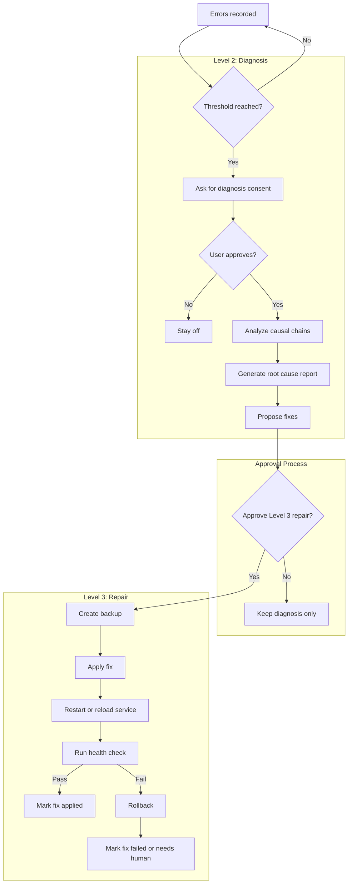

# AutoHeal

**Self-diagnosing, self-repairing infrastructure for agent systems.**

When autonomous agents run unattended, they fail silently. AutoHeal gives them the ability to detect failures, diagnose root causes, and apply fixes without human intervention.

---

## The Problem

Autonomous agents crash at 3 AM. You find out at 9 AM. You manually debug, fix, restart. Next week, same failure. The gap between "can run unattended" and "can recover unattended" is the reliability bottleneck.

## The Insight

A naive self-healing system counts errors and fixes the most frequent one. This fails because **symptoms recur until their cause is addressed.**

AutoHeal uses **Wolverine mode** : causal chain analysis and agentic coding

```
Root Cause (1x)
    └── Immediate Effect (2-3x)
        └── API Rejections (3-5x)
            └── Cascade Failures (5-10x)
```

One root cause generates 10-20 downstream errors. Fix the root and the entire cascade disappears.

**Real result:** 196 errors/week → 0 errors for 42+ consecutive days. Not by fixing 196 things. By fixing one.

---

## Architecture: Three Levels

| Level | Name | What It Does | Handles |
|-------|------|--------------|---------|
| 1 | **Recover** | Restart, retry, resume from checkpoint | ~80% of failures (transient) |
| 2 | **Diagnose** | Read error logs, trace causal chains, produce reports | Recurring patterns |
| 3 | **Repair** | Apply fix, verify, rollback on failure | Root causes |

Level 1 is your process manager's job (pm2, systemd, supervisor). 
AutoHeal focuses on Levels 2 and 3: the intelligence layer that understands *why* things break and fixes the cause.

---

## Quick Start

```bash
npm install autoheal
```

```typescript
import { AutoHeal } from 'autoheal';

const heal = new AutoHeal({
  storagePath: './data/autoheal',
  errorLogPath: './logs/errors.jsonl',
  diagnosisEngine: 'claude-code',
  projectRoot: './my-project',
  healthCheck: async () => {
    const res = await fetch('http://localhost:3000/health');
    return res.ok;
  },
  notify: (message) => console.log(message),
});

await heal.init();

// Record errors from your system
heal.recordError({
  type: 'tool_timeout',
  tool: 'web_search',
  message: 'Research task',
  error: 'Timeout after 30s',
});

// Run diagnosis (or schedule it)
const report = await heal.diagnose();
```

That's it. Ten lines to integrate.

---

## How It Works

### Error Tracking

Record errors as they happen. AutoHeal counts them, categorizes them, and watches for patterns.

```typescript
heal.recordError({
  type: 'max_iterations',      // Error classification
  tool: 'bash',                // Which tool failed (optional)
  message: 'User asked for refactor',  // What the user was doing
  error: 'Hit 10/10 iteration limit',  // Error detail
  session: 'main',             // Session identifier (optional)
});
```

### Consent Flow

AutoHeal never activates without permission. Trust escalates with capability:

1. **Threshold reached** (configurable, default: 5 errors) → asks user: "Want me to start analyzing?"
2. **User approves** → Level 2 activates. Diagnosis begins.
3. **First report with proposed fixes** → asks: "Want me to apply fixes automatically?"
4. **User approves** → Level 3 activates.
5. **User can disable at any time.** No opt-in is permanent.

### Diagnosis

The diagnosis engine reads your error logs and applies causal reasoning. It distinguishes root causes from symptoms, traces cascades, and proposes targeted fixes.

Built-in adapters:
- **Claude Code CLI** (default): spawns `claude` with the diagnosis prompt and your logs
- **Claude API**: direct API call (for systems without CLI access)
- **Custom**: provide your own diagnosis function

### Repair (Surgery)

When a fix is proposed and approved:

1. Git backup (or folder copy)
2. Apply patch
3. Restart service
4. Run health check
5. Pass → commit fix, notify user
6. Fail → automatic rollback, notify user

Safety is non-negotiable: backup before every modification, rollback on any failure, maximum 3 attempts, user notification always.

### Workflow



---

## CLI

```bash
# Initialize storage directory
autoheal init

# Check current status
autoheal status
# → Level: 2 | Streak: 42 days | Errors today: 0 | Total fixes: 11

# Run diagnosis manually
autoheal diagnose

# Apply a specific fix
autoheal apply <fix-id>

# Rollback the last fix
autoheal rollback
```

---

## Configuration

```typescript
const heal = new AutoHeal({
  // Required
  storagePath: './data/autoheal',       // Where state, reports, fixes live
  errorLogPath: './logs/errors.jsonl',  // Your structured error log
  projectRoot: './my-project',          // Root of the project to heal

  // Diagnosis
  diagnosisEngine: 'claude-code',       // 'claude-code' | 'claude-api' | custom fn
  diagnosisPrompt: undefined,           // Override the built-in prompt (optional)

  // Repair
  backup: 'git',                        // 'git' | 'folder-copy'
  healthCheck: async () => true,        // Verify system health after fix
  maxSurgeryAttempts: 3,                // Max fix attempts before giving up
  surgeryTimeout: 600_000,              // 10 min timeout per attempt

  // Notifications
  notify: (msg) => console.log(msg),    // How to reach the user

  // Behavior
  consentThreshold: 5,                  // Errors before asking to activate
  timezone: 'America/Los_Angeles',      // For report timestamps
});
```

---

## Error Log Format

AutoHeal reads structured JSONL. Each line is a JSON object:

```json
{"ts":"2026-06-01T03:00:00Z","event":"tool_timeout","tool":"web_search","message":"User asked for research","error":"Timeout after 30s","session":"main","recovery":"retry_succeeded"}
```

Required fields: `ts`, `event`, `error`
Optional fields: `tool`, `message`, `session`, `recovery`

Provide a custom `errorParser` if your logs use a different format.

---

## Examples

### Minimal Integration

```typescript
import { AutoHeal } from 'autoheal';

const heal = new AutoHeal({
  storagePath: './autoheal-data',
  errorLogPath: './errors.jsonl',
  diagnosisEngine: 'claude-code',
  projectRoot: '.',
});

await heal.init();
```

### Custom Diagnosis Engine

```typescript
const heal = new AutoHeal({
  // ...
  diagnosisEngine: async (errorLog, context) => {
    // Call your own LLM, rule engine, or analysis tool
    const report = await myCustomAnalysis(errorLog);
    return report;
  },
});
```

### Webhook Notifications

```typescript
const heal = new AutoHeal({
  // ...
  notify: async (message) => {
    await fetch('https://hooks.slack.com/...', {
      method: 'POST',
      body: JSON.stringify({ text: message }),
    });
  },
});
```

---

## Production Results

Built and validated in a personal agent harness running daily since April 2026:

| Metric | Value |
|--------|-------|
| Errors before AutoHeal | 196/week |
| Errors after (42+ days) | 0 |
| Total fixes applied | 11 |
| Fix success rate | 100% (no rollbacks needed) |
| Uptime since stabilization | 100% |

_Reference implementation: https://github.com/monbishnoi/cal_

---

## Design Principles

1. **Causal reasoning, not frequency counting.** Fix roots, not symptoms.
2. **Consent before capability.** Never activate without explicit permission.
3. **Safety is non-negotiable.** Backup before every fix. Rollback on any failure.
4. **Portable.** No framework lock-in. Any agent system with structured error logs can use this.
5. **Observable.** Every diagnosis, fix, and rollback is logged and reportable.

---

## Requirements

- Node.js 22+
- TypeScript 5+
- For `claude-code` diagnosis engine: Claude Code CLI installed and authenticated

## Development

```bash
npm install
npm run build
npm test
npx ts-node src/cli.ts status
npx ts-node src/cli.ts init
```

The source CLI expects `npm run build` first when run through `ts-node`; the published CLI uses `dist/cli.js`.

---

## License

MIT

---

## Links

- [GitHub](https://github.com/monbishnoi/autoheal)
- [Blog: "When Your Agent Learns to Fix Itself"](https://monikabishnoi.com/posts/when-your-agent-learns-to-fix-itself.html)
- [Reference integration: Cal Gateway](https://github.com/monbishnoi/cal)

---

*Created by [Monika Bishnoi](https://monikabishnoi.com). Ideas are my own. Co-written with AI.*
